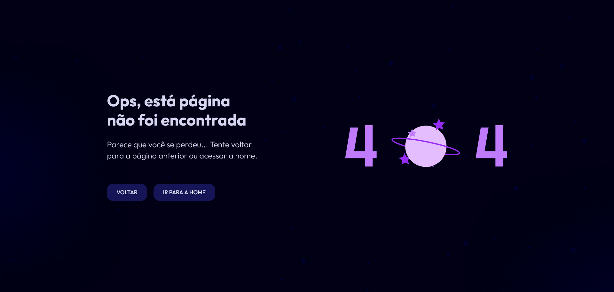
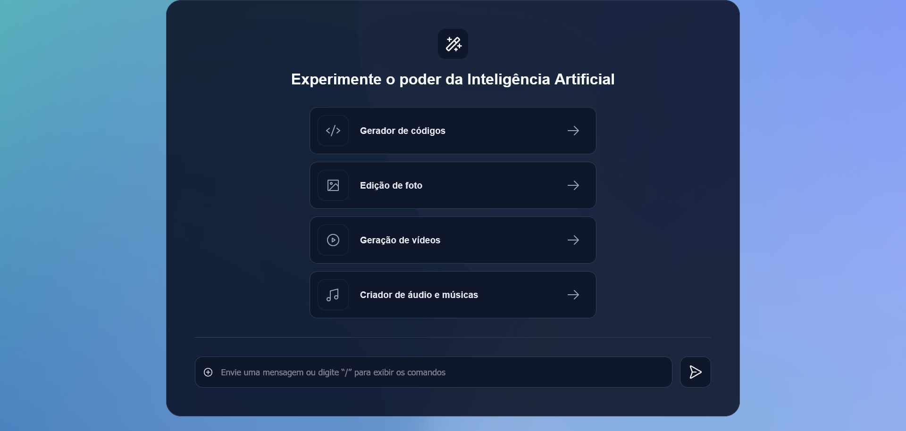

<h1 align="center"><strong>#boraCodar projetos semanais 🚀💫</strong></h1>

This repository has the purpose of registering the weekly projects proposed by <a href="https://app.rocketseat.com.br/">RocketSeat</a> in the challenges of <strong>#boraCodar</strong>. With these projects, I'm looking to develop the area, always challenging myself to do something more than proposed and develop my learning, exploring <strong>HTML</strong>, <strong>CSS</strong> e <strong>JavaScript</strong>. 🚀

 

  <h3 align="center"><strong>COMPLETED CHALLENGES</strong></h3>
  
<a href="https://www.rocketseat.com.br/boracodar">See this week's challenge</a>

   
  <table align="center">
    <thead>
      <tr>
        <th align="center">
          
<small>#</small>

        </th>
        <th align="center">
          
<small>PROJECT NAME</small>

        </th>
        <th align="center">
          
<small>PREVIEW</small>

        </th>
      </tr>
    </thead>
    <tbody>
      <tr>
        <td><strong>27</strong></td>
        <td><a href="https://github.com/brunoabunai/bora-codar/tree/main/27.%20Error-Page"><strong>Error page 404</strong></a></td>
        <td align="center"></td>
      </tr>
      <tr>
        <td><strong>28</strong></td>
        <td><a href="https://github.com/brunoabunai/bora-codar/tree/main/27.%20Error-Page"><strong>Error page 404</strong></a></td>
        <td align="center"></td>
      </tr>
      <tr>
        <td><strong>29</strong></td>
        <td><a href="https://github.com/brunoabunai/bora-codar/tree/main/27.%20Error-Page"><strong>Error page 404</strong></a></td>
        <td align="center"></td>
      </tr>
    </tbody>
  </table>

